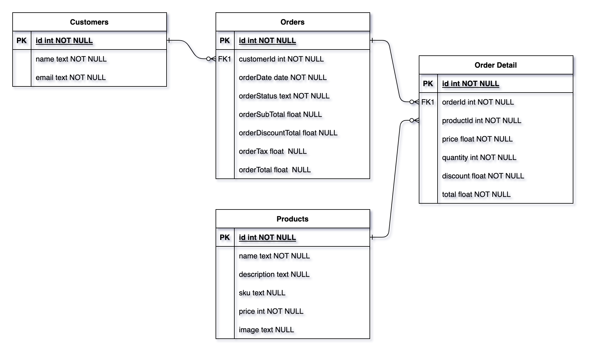

# jonar-code-challenge

## Objective
- Design and create a backend to handle incoming orders
- Send an order confirmation with an invoice
- Create a products database

## Requirements
- Setup a nodejs server to host a REST API
- Database to hold all the information

## Other Requirements
- Use PostgreSQL as a database engine
- Implement Docker for containerization
- Use redis to cache hot objects
- Implement JWT for authenticated API calls

## Completed Features
- Nodejs server based on Express to serve REST endpoints
- Accept orders from customers, generate invoice and send order confirmation to customer (mocked)
- Used PostgreSQL as a database engine
- Seeding script to populate `products` and `customers`
- Implemented JWT token for authenticated API calls
- Added redis to cache objects

## Database Design (ERD)

## Steps to run this application
Docker compose includes the setup for dependencies for postgres and redis.
To run this app via docker run the following commands:
- `docker build . -t <container-tag-name>`
- `docker compose up`

To run this app locally in development environment, run the following:
- `npm install`
- `npm run build`
- `npm run seed`
- `npm run dev:watch`

## Endpoints Routes
### Auth
|Method|Path        | Description                             |
|---|-------------|-----------------------------------------|
|GET| `auth/token` | Get token to access other secure routes |

### Customers
|Method|Path        | Description    |
|-----|------|--------------------|
| GET | /    | Get all customers  |
| GET | /:id | Get customers by id|
| PUT | /    | Add a new customer |

### Products
|Method|Path        | Description |
|-|-|--------------------|
| GET | /    | Get all products   |
| GET | /:id | Get products by id |
| PUT | /    | Add a new product  |

### Order
| Method | Path | Description     |
|--------|------|-----------------|
| GET    | /    | Get all orders  |
| GET    | /:id | Get order by id |
| PUT    | /    | Add a new order |
| POST   | /    | Update an order |